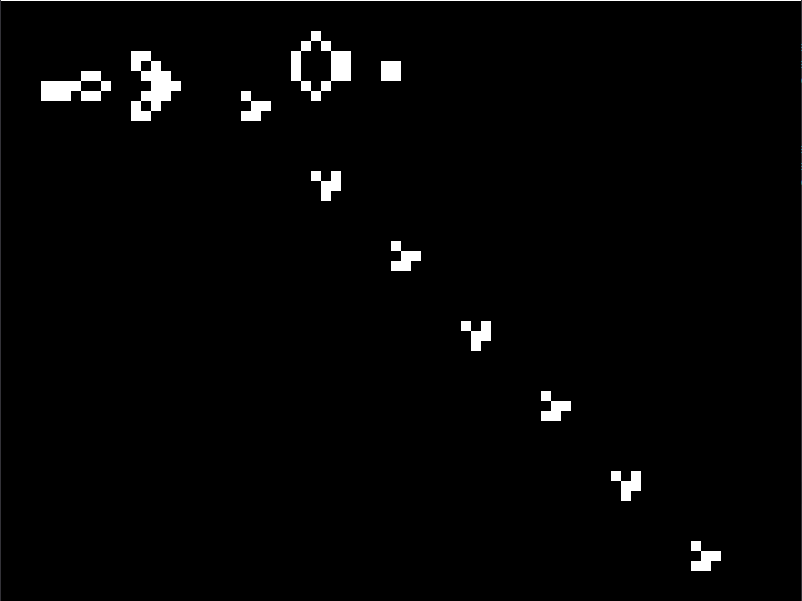
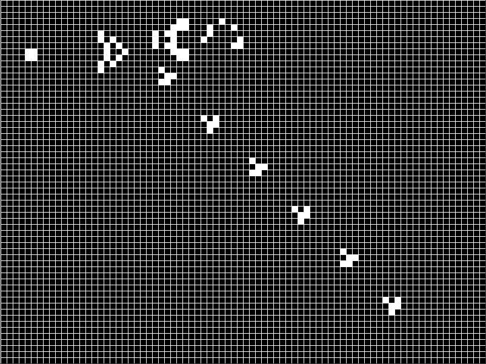

# Game Of Life

This is my implimentation of Conways Game of Life.

- Run main.py (requires pygame) to start the application
- In pause mode there is a white grid to place down the living tiles in white using the mouse
- Press p to unpause/pause the application once setup.

# Gallery

